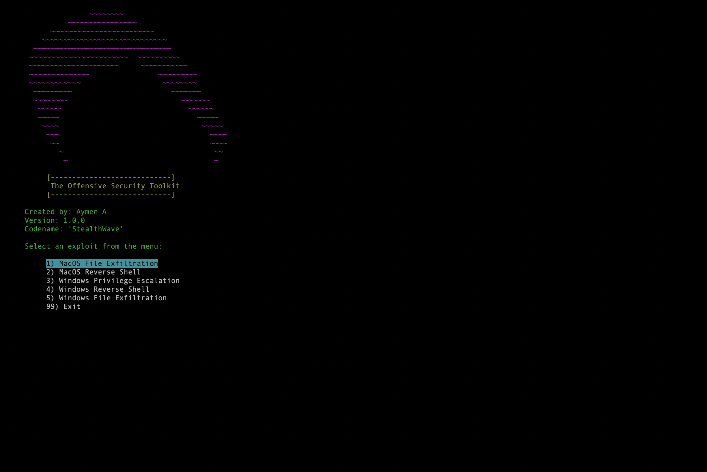

# Offensive Security Tool

This project is a multi-purpose offensive security tool for file exfiltration, reverse shells, and privilege escalation on both macOS and Windows platforms.

## Features
- **File Exfiltration**: Transfer files from the target machine to a server (supports macOS and Windows).
- **Reverse Shells**: Execute reverse shells to connect to a target machine.
- **Privilege Escalation**: Exploit vulnerabilities to gain higher-level permissions on the target machine.

## Preview

Note: This project has NOT been tested on Windows. The Windows-specific scripts are included but require further validation.

# Usage Instructions

**1. Setting Up the Project**
Before running the project, ensure that you have Python 3 installed. You can use the following steps to set up the virtual environment and install the required dependencies.
# Clone the repository and navigate to the project directory
git clone <repository-url>
cd offensive_security_tool

# Set up a virtual environment
python3 -m venv .venv

# Activate the virtual environment
source .venv/bin/activate  # On macOS/Linux
# .venv\Scripts\activate  # On Windows

# Install dependencies
pip install -r requirements.txt

**2. Configuration: Setting Up Environment Variables**
You can set environment variables for customizing the server IP and port. By default, the project uses 127.0.0.1 as the server IP and 5001 as the port.
Example of setting environment variables (macOS/Linux):
export SERVER_IP="192.168.1.10"    # Set your actual server IP
export SERVER_PORT="5001"          # Set server port
export SERVER_URL="http://192.168.1.10:5001/exfiltrate"  # Full server URL for exfiltration

Example of setting environment variables (Windows PowerShell):
$env:SERVER_IP="192.168.1.10"
$env:SERVER_PORT="5001"
$env:SERVER_URL="http://192.168.1.10:5001/exfiltrate"

Alternatively, you can store these variables in a .env file:
# .env file example
SERVER_IP="192.168.1.10"
SERVER_PORT="5001"
SERVER_URL="http://192.168.1.10:5001/exfiltrate"

**3. Running the Server**
Start the Flask server to receive exfiltrated files.
python3 server.py
By default, the server will run on http://127.0.0.1:5001, unless you've changed the environment variables.

**4. Running the Offensive Security Toolkit**
You can start the toolkit by launching the main.py file. This will give you a command-line menu where you can choose which exploit to run.
python3 main.py

Menu Options:
1) MacOS File Exfiltration
2) MacOS Reverse Shell
3) Windows Privilege Escalation (untested)
4) Windows Reverse Shell (untested)
5) Windows File Exfiltration (untested)
99) Exit

**5. Running Exploits**
Example: Running MacOS File Exfiltration
Choose the MacOS File Exfiltration option from the menu.
Enter the path to the file you want to exfiltrate when prompted.
The file will be transferred to the remote server.

Logging
Logs for the server and file exfiltration actions are stored in the logs/ directory.

server.log: Captures server-side logs, such as received chunks and any errors that occur on the server side.
exfiltration.log: Captures logs related to the file exfiltration process, such as sending chunks and errors.

**6. Stopping the Toolkit**
You can stop the server by pressing Ctrl + C in the terminal where the server is running. The main menu can be exited by selecting option 99.

Customization & IP Configuration
Dynamic IP Handling: The IP address and port for the server are dynamically set using environment variables (SERVER_IP, SERVER_PORT). If these are not set, the project defaults to 127.0.0.1 and port 5001.
Environment Variables: Ensure that environment variables are set correctly before running the scripts. You can modify these variables based on the network environment.

Known Issues
Windows Support: While Windows-specific exploits are included in the toolkit, they have not been tested. These scripts might require modifications and further validation to ensure they function correctly on Windows systems.
Encryption: Encryption is currently disabled for simplicity, but the encryption.py utility can be integrated for securing the exfiltrated data.

**Requirements**
Python 3.x
Flask
Requests
Any additional dependencies specified in requirements.txt
